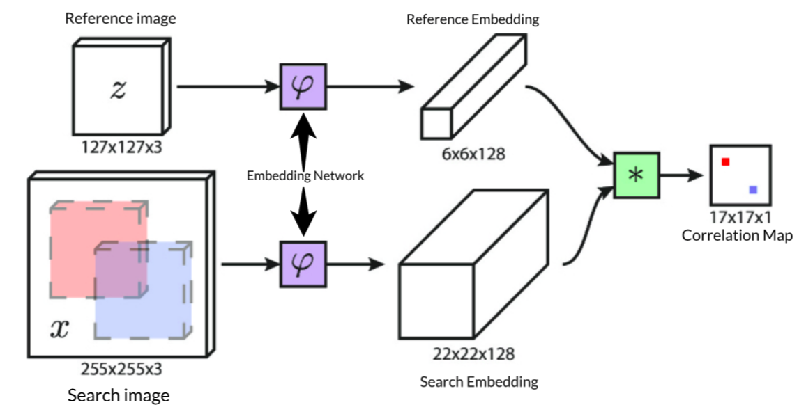
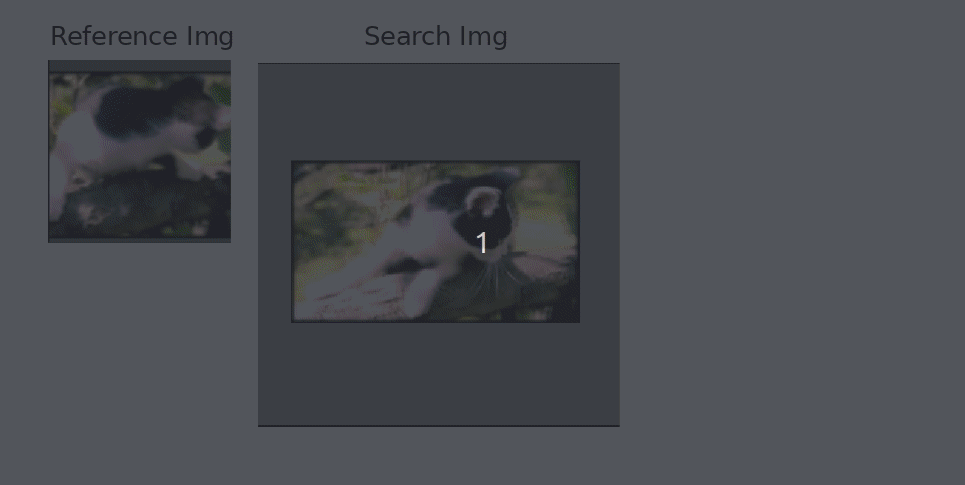
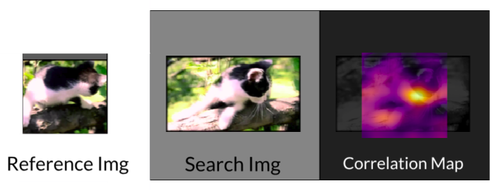
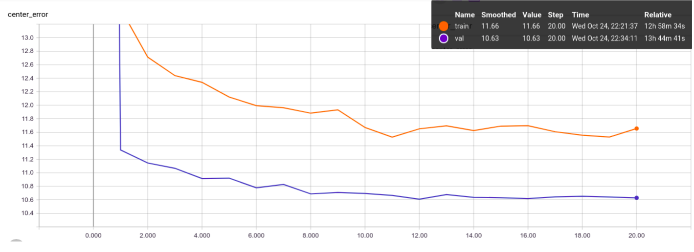
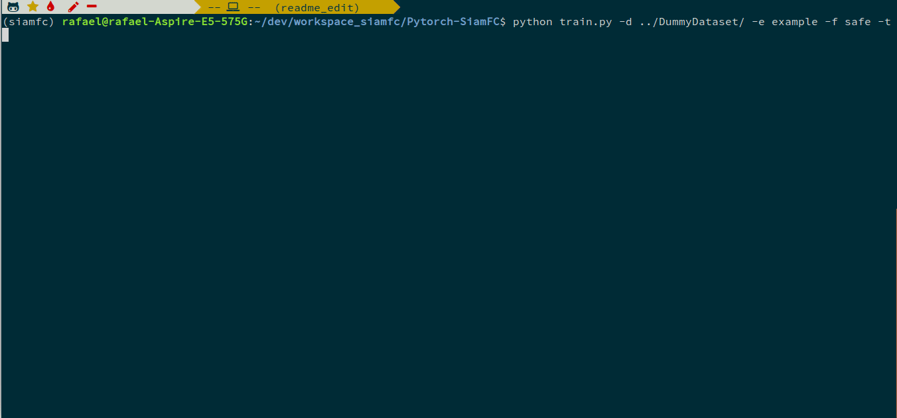
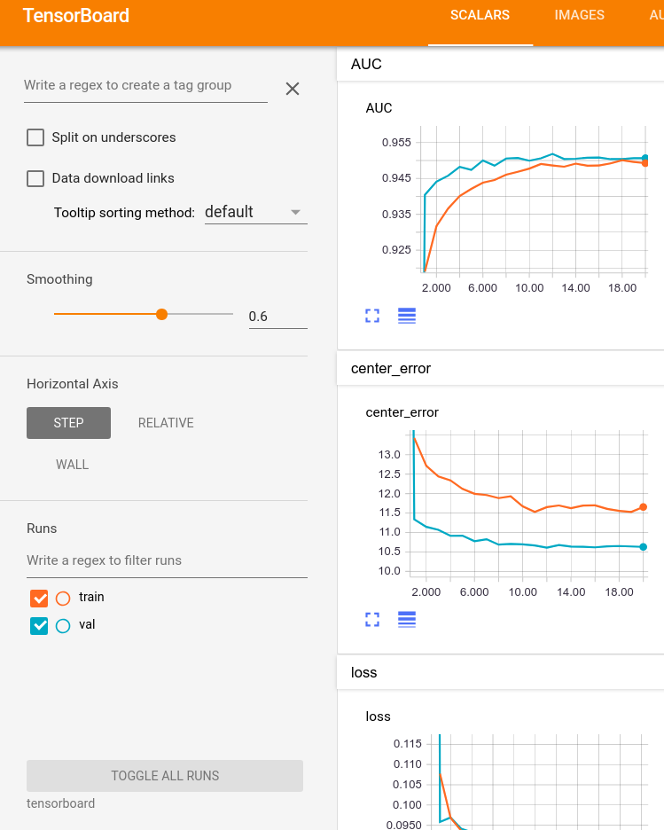
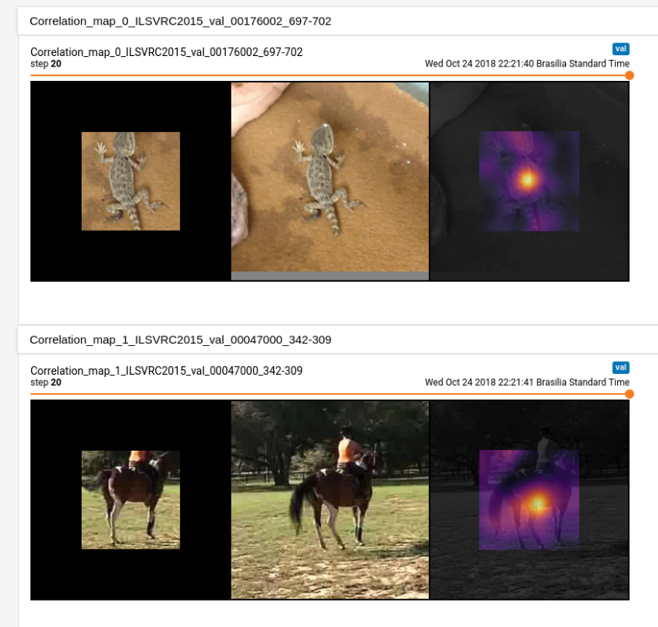
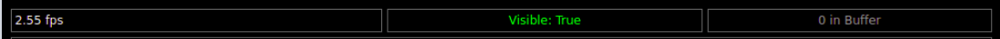
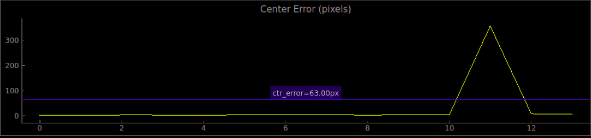

# SiameseFC PyTorch implementation

## Introduction

This project is the Pytorch implementation of the object tracker presented in 
[Fully-Convolutional Siamese Networks for Object Tracking](https://arxiv.org/pdf/1606.09549.pdf),
also available at [their project page](https://www.robots.ox.ac.uk/~luca/siamese-fc.html).
The original version was written in matlab with the MatConvNet framework, available
[here](https://github.com/bertinetto/siamese-fc) (trainining and tracking), but this
python version is adapted from the TensorFlow portability (tracking only),
available [here](https://github.com/torrvision/siamfc-tf).

## Organization

The project is divided into three major parts: [**Training**](#training), [**Tracking**](#tracking) and a [**Visualization Application**](#visualization-application).

## Training

The main focus of this work, the **Training** part deals with the training of the Siamese Network in order to learn a similarity metric between patches, as
described in the paper.

<center>
    <figure>    
        
        <figcaption> The <b>Siamese Network</b> passes both images through
        the embedding network and then does the correlation between the embeddings, as shown below.
        </figcaption>
    </figure>        
</center>

<center>
    <figure>
        
        <figcaption> The peak of the <b>correlation map</b> is supposed to be 
        located at the center of the map (because the images are both centered in the target).
        </figcaption>
    </figure>
</center>

<center>
    <figure>
        
        <figcaption>Here we overlay the correlation map with the search image, the peak value indicates the estimated center position of the target.
        </figcaption>
    </figure>
</center>

### Results - Training

The only training metric comparable between different parameters and implementations is the average *center error*  (or *center displacement*). The authors provide this metric in **appendix B** of their paper [Learning feed-forward one-shot learners](https://arxiv.org/pdf/1606.05233.pdf), which is 7.40 pixels for validation and 6.26 pixels for training.

Our Baseline Results are shown below:

<center>
    <figure>
        
        <figcaption>
        </figcaption>
    </figure>
</center>

We are around 4 pixels behind the authors, which we hypothesize that is mainly due to:

* The lack of a bicubic upscaling layer on the correlation map, which effectively causes our correlation map to have a resolution 4 times lower than the original image (due to the network's stride).
* The lack of class normalization of the loss to deal with the unbalance between negative and positive elements on the correlation map label (way more negative than positive positions). 

On the other hand, **we are way less prone to overfitting**, because we sample the pairs differently on each training epoch, as opposed to the authors, that choose all the pairs beforehand and use the same pairs on each training epoch.

This trained model is made available as *BaselinePretrained.pth.tar*.

### How to Run - Training

1. **Prerequisites:** The project was built using **python 3.6** and tested on Ubuntu 16.04 and 17.04. It was tested on a **GTX 1080 Ti** and a **GTX 950M**. Furthermore it requires [PyTorch 4.1](https://pytorch.org/). The rest of the dependencies can be installed with:  
```
# Tested on scipy 1.1.0
pip install scipy
# Tested on scikit-learn 0.20.0
pip install scikit-learn 
# Tested on tqdm 4.26.0
pip install tqdm
# Tested on tensorboardx 1.4
pip install tensorboardx
# Tested on imageio 2.4.1
pip install imageio
# To run the TensorBoard files later on install TensorFlow. 
pip install tensorflow

# To run the visualization app you need PyQt5 and pyqtgraph
# Tested on pyqt 5.6.0 
pip install pyqt5
# Tested on pyqtgraph 0.10.0
pip install pyqtgraph
```
In case you have Anaconda, install the conda virtual environment with:
```
# Used conda 4.5.11
conda env create -f environment.yaml
conda activate siamfc

# The pyqtgraph is not included and needs to be installed with pip
pip install pyqtgraph

```

(**OPTIONAL:** To accelerate the dataloading refer to [this section](#accelerating-data-loading))

2. Download the ImageNet VID Dataset in http://bvisionweb1.cs.unc.edu/ILSVRC2017/download-videos-1p39.php and extract it on the folder of your choice (*OBS: data reading is done in execution time, so if available extract the dataset in your SSD partition*). You can get rid of the *test* part of the dataset, since it has no Annotations. 

3. For each new training we must create an *experiment folder* (the folder stores the training parameters and the training output):
```
# Go to the experiments folder
cd training/experiments
# Create your experiment folder named <EXP_NAME>
mkdir <EXP_NAME>
# Copy the parameter file from the default experiment folder
cp default/parameters.json <EXP_NAME>/
```
4. Edit the *parameters.json* file with the desired parameters. The description of each parameter can be found [here](#training-parameters).
5. Run the *train.py* script:
```
# <EXP_NAME> is the name of the experiment folder, NOT THE PATH. 
python train.py --data_dir <FULL_PATH_TO_DATASET_ROOT> --exp_name <EXP_NAME>
```
<center>
    <figure>
        
        <figcaption>This gif illustrates the execution of the training script. It uses very few epochs just to give a feel of the execution. A serious training execution could take a whole day.
        </figcaption>
    </figure>
</center>


* Use `--time` in case you want to profile the execution times. They will be saved in the train.log file.

6. The outputs will be:
* `train.log`: The log of the training, most of which is also displayed in the terminal.
* `metadata.train` and `metadata.val`: The metadata of the training and validation datasets, which is written on the start of the program. **Simply copy these files to any new experiment folder to save time on set up (about 15 minutes in my case).**      
* `metrics_val_last_weights.json`: The json containing the metrics of the most recent validation epoch. Human readable.  
* `metrics_val_best_weights.json`: The json containing the metrics of the validation epoch with the best AUC score. Human readable.   
* `best.pth.tar` and `last.pth.tar`: Dictionary containing the state_dictionary among other informations about the model. Can be loaded again later, for
training, validation or inference. Again *last* is the current epoch and *best* is the best one.   
* `tensorboard`: Folder containing the **tensorboard** files summarizing the training. It is separated in a *val* and a *train* folder so that the curves can be plotted in the same plot. To launch it type: 
```
# You need TensorFlow's TensorBoard installed to do so.
tensorboard --logdir <path_to_experiment_folder>/tensorboard 
``` 

<center>
    <figure>
        
        <figcaption>The three metrics stored are the mean <b>AUC</b> of the the ROC curve of the binary classification error between the label correlation map (defined by the parameters) and the actual correlation map, as well as the <b>Center Error</b>, which is the distance in pixels between the peak position of the correlation map and the actual center. Lastly, we also plot the mean <b>Binary Cross-Entropy Loss</b>, used to optimize the model.
        </figcaption>
    </figure>
</center>

**OBS**: Our definition of the loss is slightly different than the author's, but should be equivalent. Refer to [Loss Definition](#loss-definition).
<center>
    <figure>
        
        <figcaption>We also store Ref/Search/Correlation Map trios for each epoch, for debugging and exploration reasons. They are collected in each validation epoch, thus the first image corresponds to the validation before th e first training epoch. They allow us to see the evolution of the network's estimation after each training epoch. </figcaption>
    </figure>
</center>

**OBS:** To set the number of trios stored in each epoch, use the `--summary_samples <NUMBER_OF_TRIOS>` flag:
```
python train.py -s 10 -d <FULL_PATH_TO_DATASET_ROOT> -e <EXP_NAME> 
```
The images might take a lot of space though, especially if the number of epochs is large.

### Additional Uses

#### Retraining/Loading Pretrained Weights

You can continue training a network or load pretrained weights by calling the train script with the flag `--restore_file <NAME_OF_MODEL>` where <NAME_OF_MODEL> is the filename **without** the *.pth.tar* extension (e.g. *best*, for *best.pth.tar*). The program then searchs for the file NAME_OF_MODEL.pth.tar inside the experiment folder and loads its state as the initial state, the rest of the training script continues normally.  
```
python train.py -r <NAME_OF_MODEL> -d <FULL_PATH_TO_DATASET_ROOT> -e <EXP_NAME>
```

#### Evaluation Only

Once you finished training and dispose of a *.pth.tar file containing the network's weigths, you can evaluate it on the dataset by using the `--mode eval` combined with `--restore_file <NAME_OF_MODEL>`:
```
python train.py -m eval -r <NAME_OF_MODEL> -d <FULL_PATH_TO_DATASET_ROOT> -e <EXP_NAME>
```
The results of the evaluation are then stored in `metrics_test_best.json`.


### Tracking

[Under Development]

## Datasets

The dataset used for the tracker evaluation is a compilation of sequences from
the datasets [TempleColor](http://www.dabi.temple.edu/~hbling/data/TColor-128/TColor-128.html),
[VOT2013, VOT2014, and VOT2016](http://www.votchallenge.net/challenges.html). The Temple
Color and VOT2013 datasets are annotated with upright rectangular bounding boxes
(4 numbers), while VOT2014 and VOT2016 are annotated with rotated bounding boxes
(8 numbers). The order of the annotations seems to be the the following:

* TC: LowerLeft(x , y), Width, Height
* VOT2013: LowerLeft(x, y), Width, Height
* VOT2014: UpperLeft(x, y), LowerLeft(x, y), LowerRight(x, y), UpperRight(x, y)
* VOT2016: LowerLeft(x, y), LowerRight(x, y), UpperRight(x, y), UpperLeft(x, y)

OBS: It is possible that the annotations in VOT204 and 2016 simply represent a
sequence of points that define the contour of the bounding box, in no particular
order (but respecting the adjency of the the points in the rectangle). I didn't
check all the ground-truths to guarantee that all the annotations are in the
particular order described here. If something goes very wrong, you might want to
confirm this.

The dataset used for the training is the 2015 ImageNet VID, which contains
videos of targets where each frame is labeled with a bounding box around the
targets.

## Visualization Application

<center>
    <figure>
        
        <figcaption>
        </figcaption>
    </figure>
</center>

I've also developped a visualization application to see the output of the network in real time. The objective is to observe the merits and limitations of the network **as a similarity function**, **NOT** to evaluate nor visualize the complete tracker.

The vis_app simply compares the reference embedding **with the whole frame** for each frame in a given sequence, instead of comparing it with a restricted area like the tracker. The basic pipeline is:

* Get the first frame in which the target appears.
* Calculate a resizing factor such that the reference image (bounding box + context region) has 127 pixels, just as during training. All the subsequent frames will be resized as well.
* Pass the reference image through the embedding branch to get the reference embedding. There is **no update** of the reference embedding.
* For each frame of the sequence we patch the sides with zeros, so that the output dimensions of the score map have the same dimensions as the frame itself.
* Convolve the the ref embedding with the frame's embedding (which can be quite big) to get the full score map. The score map is upscaled to "undo" the effect of the stride and is overlaid over the frame. The score map's intensity is encoded to color with the [inferno colormap](https://matplotlib.org/users/colormaps.html).
* We also plot in each frame the peak of the score map as the network's guess of the current target position. We plot the Center Error curve as well.     

The application is implemented using two threads: the **display thread** that takes care of the GUI and the **producer thread** that does all the computations. 

<center>
    <figure>
        
        <figcaption> In the top of the window we show the current fps rate of the display; the visibility status of the target (true if the target is inside the frame); and the number of frames in the buffer that stores the frames produced by the produced thread. 
        </figcaption>
    </figure>
</center>

<center>
    <figure>
        
        <figcaption> In the bottom of this image we have the full path to the current frame; the reference image shows the image being used as reference by the network; The ground truth shows the current frame with the bounding box overlaid; and the Score Map shows the score map calculated by the network over the current frame, the amount of each can be controlled with an <b>alpha argument</b>. A green cross is placed in the peak of the score map.
        </figcaption>
    </figure>
</center>

<center>
    <figure>
        
        <figcaption> Finally we have a plot of the Center Error per frame, being the distance between the score map's peak and the center of the ground thruth bounding box. We Draw a blue line in 63 pixels (half of the Reference Image side), that serves as a threshold over which the position might be outside the bounding box. 
        </figcaption>
    </figure>
</center>

### How to Run - Visualization Application

Assuming the ImageNet VID dataset is the path \<ILSVRC>, and that the PyQt5 and pyqtgraph packages are installed: 
```
# -d is the path to the dataset and -n the path to the model's file.
python vis_app.py -d <ILSVRC> -n BaselinePretrained.pth.tar -t train -s 10
```
Also, the sequences are separated into `train` and `val` sequences according to the dataset's organization, and numbered in increasing order. So to get the 150th training sequence, use the arguments `-t train -s 149` (index starts at zero). The `train` sequences range from 0 to 3861 and the `val` from 0 to 554.

You can also set the alpha value from 0.0 to 1.0, that controls how much of the frame is overlaid with the score map. To get the score map without the frame behind it use the argument `-a 1`. To see all the arguments use `python vis_app.py -h`   


## Parameters

Both tracking and training scripts are defined in terms of user-defined parameters,
which define much of their behaviour. The parameters are defined inside .json files
and can be directly modified by the user. In both tracking and training a given
set of parameters defines what we call an `experiment` and thus they are placed
inside folders called experiments inside both training and tracking.
To define new parameters for a new experiment, copy the default experiment folder
with its .json files and name it accordingly, placing it always inside the
training(or tracking)/experiments folder. Here below we give a brief description
of the basic parameters:

### Training Parameters:

* `model`: The Embedding Network to be used as the branch of the Siamese Network, the models are defined in [models.py](training/models.py). The models available are *BaselineEmbeddingNet*, *VGG11EmbeddingNet_5c*, *VGG16EmbeddingNet_8c*.
* `parameter_freeze`: A list of the layers of the Embedding Net that will be frozen (parameters will not be change). The numeration refers the *nn.Sequential* class that defines the Network in [models.py](training/models.py). E.g. [0, 1, 4, 5] with *BaselineEmbeddingNet* freezes the two first convolutional layers (0 and 4) along with the two first BatchNorm layers (1 and 5).
* `batch_size`: The batch size in terms of reference/search region pairs. The
    authors of the paper suggested using a batch of 8 pairs.
* `num_epochs`: Total number of training epochs. One validation epoch is done before training starts and after each training epoch.
* `train_epoch_size`: The number of iterations for each train epoch. If it is
    bigger than the total number of frames in the dataset, the epoch size
    defaults to the whole dataset, warning the user of it.
* `eval_epoch_size`: The number of iterations for each validation epoch. If it
    is bigger than the total number of frames in the dataset, the epoch size
    defaults to the whole dataset, warning the user of it.
* `save_summary_steps`: The number of batches between the metrics evaluation.
    If set to 0 all batches are evaluated in terms of the metrics after the
    loss is calculated. If set to 10, every tenth batch is evaluated.
* `optim`: The optimizer to be used during training. Options include *SGD* for
    stochastic gradient descent, and *Adam* for Adaptative Momentum.
* `optim_kwargs`: The keywords associated with each optimizer's initialization.
    It is itself a dictionary, and should follow the pytorch documentation.
    For example, if optim is `SGD` we could specify it as
    {`lr`: 1e-3, `momentum`:0.9}, for a learning rate of 0.001 and momentum
    of 0.9. Each optimizer has its available keywords, cf.
    https://pytorch.org/docs/stable/optim.html for more info.
* `max_frame_sep`: The maximum frame separation, the maximum distance between
    frames in each pairs chosen by the dataset. Default value is 50.
* `reference_sz`: The reference region size in pixels. Default is 127.
* `search_sz`: The search region size in pixels. Default is 255.
* `final_sz`: The final size after the pairs are passed throught the model.
* `upscale`: A boolean to indicate if the network should have a bilinear upscale
    layer. OBS: Might slow training a lot.
* `pos_thr`: The positive threshold distance in the label, the threshold of
    the distance to the center that is considered a positive pixel.
* `neg_thr`: The negative threshold distance in the label, the threshold of
    the distance to the center that is considered a negative pixel. Every
    pixel with a distance between the positive and negative thresholds is
    considered neutral, and is not penalised either way.
* `context_margin`: The context margin for the reference region.


### Tracking Parameters:

[Under Development]

### Accelerating Data Loading

[Coming Soon]

### Loss Definition

[Coming Soon]

ACKNOWLEDGEMENTS:
This project was originally developed and open-sourced by Parrot Drones SAS.
